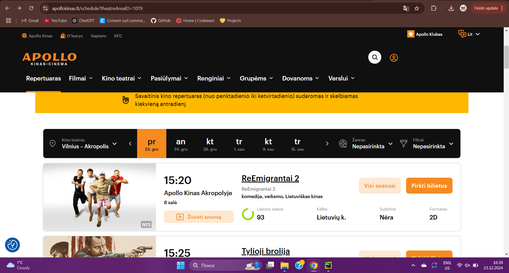
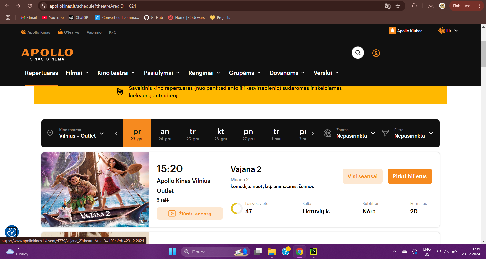
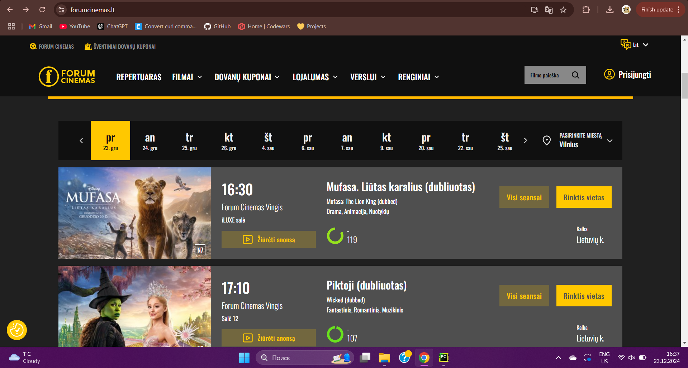
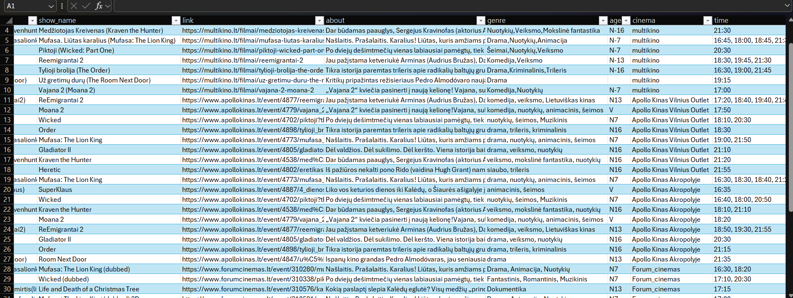
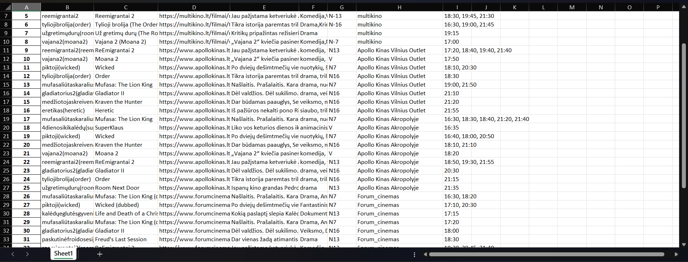

# Movie Scraping Project (Vilnius Cinemas)

This project scrapes movie showtimes, genres, descriptions, and other details from various cinemas in Vilnius, Lithuania. The cinemas include Multikino, Apollo, and Forum Cinemas. The data is stored in CSV and Excel formats for easy use.

## Project Overview

This project uses several libraries such as `Selenium`, `BeautifulSoup`, and `requests` to scrape movie data from the cinema websites. It collects information like:

- Movie name (in Lithuanian and English)
- Showtimes
- Movie genres
- Age ratings
- Descriptions
- Cinema names and links

The script can be scheduled to run at specified intervals using the `schedule` library.

## Features

- **Automatic Web Scraping**: The script automatically scrapes movie schedules from multiple cinema websites in Vilnius, including Multikino, Apollo, and Forum Cinemas.
  
- **Dynamic Content Handling**: Utilizes Selenium to scrape dynamic content from JavaScript-rendered websites that require browser automation.

- **Data Extraction**: Extracts detailed movie information such as movie name, genre, showtimes, age rating, and a short description.

- **Data Cleaning**: Automatically removes unnecessary words (e.g., "3D", "(dubbed)") and extra spaces from movie titles for consistency.

- **Timezone Support**: Takes into account Lithuania's local time (Europe/Vilnius) for scheduling tasks and managing showtimes.

- **Data Storage**: Scraped movie data is stored in both CSV and Excel formats for easy access and analysis.

- **Daily Scheduled Scraping**: Using the `schedule` library, the script runs automatically at a specified time each day, ensuring up-to-date movie information.

- **Multiple Cinema Sites Support**: The script supports multiple cinema chains (Multikino, Apollo, and Forum Cinemas) to gather a comprehensive list of movies.

- **Link to Movie Pages**: Each movie entry includes a direct link to the cinema's webpage for more information.

- **Scalable**: The script can be extended to scrape additional cinema websites or movie-related data sources.

## Technologies Used

This project utilizes the following technologies:

- **Python**: The primary programming language used for the web scraping, data processing, and scheduling tasks.
  
- **Selenium**: A browser automation tool that allows interaction with websites, used here to scrape dynamic content from cinema websites.

- **BeautifulSoup**: A library for parsing and extracting data from HTML and XML files. It's used to parse the raw HTML data from the websites.

- **requests**: A library for making HTTP requests. It fetches the raw HTML data from static pages when Selenium is not required.

- **lxml**: A library used for parsing HTML/XML data more efficiently than the default parser in BeautifulSoup.

- **pytz**: A library for working with time zones, used here to handle Lithuania's local time zone when scheduling tasks.

- **pandas**: A data analysis and manipulation library used to organize and store the scraped data in tabular format (CSV and Excel).

- **schedule**: A Python library for scheduling periodic tasks. It’s used to run the scraping process at specific times, such as once every day.

These technologies work together to scrape, process, and store data from Vilnius cinemas automatically.

## How It Works
The project operates in the following steps, with key elements of the code explained:

```python
import lxml
from bs4 import BeautifulSoup
import requests
import json
from selenium import webdriver
import time
from datetime import datetime
import pytz
from selenium.webdriver.chrome.service import Service
import pandas as pd
import schedule
```

Imports libraries:

- **lxml**: Parses HTML/XML data.
- **BeautifulSoup**: A library to parse HTML data.
- **requests**: Allows making HTTP requests to fetch data.
- **json**: Used to parse JSON data.
- **webdriver and Service from selenium**: For automating browser actions (using Chrome in this case).
- **time**: Provides time-related functions such as delays.
- **datetime**: For working with date and time.
- **pytz**: Handles timezone-related operations.
- **pandas**: For handling data in tables (DataFrame).
- **schedule**: For scheduling tasks at specific intervals.

---

### 1. **URLs for Cinema Schedules:**
```python
url_multi_cinema = "https://multikino.lt/repertuaras/vilnius"
url_apollo_akrop = "https://www.apollokinas.lt/schedule?theatreAreaID=1019"
url_apollo_outlet = "https://www.apollokinas.lt/schedule?theatreAreaID=1024"
url_forum_cinema = "https://www.forumcinemas.lt"
```
- These variables store the URLs of the cinema schedules for various cinemas in Vilnius, Lithuania. The script will use these URLs to scrape movie data from different cinema websites.

---

### 2. **Time Settings:**
```python
lithuania_time = pytz.timezone("Europe/Vilnius")
lithuania_day = datetime.now(lithuania_time).strftime("%d")
```
- `lithuania_time`: This sets the timezone to Lithuania (Europe/Vilnius) using the `pytz` library.
- `lithuania_day`: This gets the current day in Lithuania’s timezone and formats it as a 2-digit string.

---

### 3. **Words to Remove from Movie Titles:**
```python
words_to_remove = ["(dubbed)", "(dubliuotas)", "3D", "The", "the", "Part", "One"]
other_remove = [",", ":", "-", ".", " ", " "]
```
- `words_to_remove`: A list of words/phrases that should be removed from the movie titles, such as "(dubbed)", "3D", etc.
- `other_remove`: A list of characters like commas, colons, hyphens, etc., that will be stripped from the titles.

---

### 4. **Initializing Empty Movie List:**
```python
movies = []
```
- This is an empty list where the scraped movie data will be stored.

---

### 5. **Request Headers:**
```python
headers = {
    "Accept" : "*/*",
    "User-Agent" : "Mozilla/5.0 (Windows NT 10.0; Win64; x64) AppleWebKit/537.36 (KHTML, like Gecko) Chrome/128.0.0.0 Safari/537.36"
}
```
- The `headers` dictionary contains the user agent for the requests. This mimics a real browser request to avoid being blocked by the website.

---

### 6. **Selenium WebDriver Setup:**
```python
service = Service(r"C:\Users\edvin\Desktop\Projects\Drivers\chromedriver-win64\chromedriver.exe")
options = webdriver.ChromeOptions()
options.add_argument("--headless")
options.add_argument("--disable-gpu")
options.add_argument("--window-size=1920x1080")
driver = webdriver.Chrome(service=service, options=options)
```
- `service`: This specifies the path to the ChromeDriver executable required to interact with the browser.
- `options`: Configures the WebDriver to run Chrome in headless mode (without opening a browser window), disables GPU acceleration, and sets the browser window size.
- `driver`: Initializes the WebDriver with the specified options.

---

### 7. **Multikino Website Scraping Function:**
```python
def get_multikino(url):
    print("Start parse Multikino")
    try:
        driver.get(url)
        time.sleep(5)
        driver.execute_script("window.scrollTo(0, document.body.scrollHeight);")
        time.sleep(5)
        src = driver.page_source
    except Exception as exe:
        print(exe)
```
- `get_multikino(url)`: This function scrapes the movie data from the Multikino website.
  - `driver.get(url)`: Opens the provided URL in the browser.
  - `time.sleep(5)`: Pauses the script for 5 seconds to ensure the page has loaded.
  - `driver.execute_script(...)`: Scrolls the page to load more content if necessary.
  - `src = driver.page_source`: Gets the page source (HTML) after it has loaded.

---

### 8. **Processing and Extracting Movie Data:**
```python
soup = BeautifulSoup(src, "lxml")
div = soup.find_all("div", attrs={"data-hidden":"false"})
seen_movies = set()
seen_time = set()
```
- `soup`: Parses the page source using BeautifulSoup to extract relevant HTML.
- `div`: Finds all the div elements that contain the movie data.
- `seen_movies` and `seen_time`: Sets to keep track of already scraped movie entries to avoid duplicates.

---

### 9. **Extracting Movie Details:**
```python
for item in div:
    name = item.find("span", attrs={"rv-text" : "item.title"}).text
    for word in words_to_remove:
        if word in name:
            name = name.replace(word, "").strip().lower()
    for other in other_remove:
        if other in name:
            name = name.replace(other, "").strip()
    show_name = item.find("span", attrs={"rv-text" : "item.title"}).text
    href = item.find("a", class_="filmlist__info__more link link--light").get("href")
    full_href = "https://multikino.lt"+href
    about_film = item.find(attrs={"rv-text":"item.synopsis_short"}).text
    genre_elements = item.find("p", class_="film-details").find_all(attrs={"rv-text":"genre.name"})
    genres = [genre.text for genre in genre_elements]
    genres_str = ",".join(genres)
    age = item.find("span", attrs={"rv-text":"item.info_age"}).text
    start_time_elements = item.find("div", class_="day__section").find_all(attrs={"rv-datetime":"showing.date_time"})
    start_times = [start_time.text for start_time in start_time_elements]
    start_times_str = ", ".join(start_times)
```
- **Movie Name**: Extracts the movie name and cleans it by removing unnecessary words and characters.
- **Link**: Extracts the movie's detailed page link.
- **About Film**: Extracts the short synopsis of the movie.
- **Genres**: Extracts the genres of the movie and joins them into a single string.
- **Age Rating**: Extracts the age rating for the movie.
- **Showtimes**: Extracts the showtimes for the movie and joins them into a string.

---

### 10. **Storing Movie Data:**
```python
record = {
    "name" : name.lower(),
    "show_name" : show_name,
    "link" : full_href,
    "about" : about_film,
    "genre" : genres_str,
    "age" : age,
    "cinema" : "multikino",
    "time" : start_times_str
}
if (name, full_href) not in seen_movies:
    movies.append(record)
    seen_movies.add((name, full_href))
```
- A dictionary `record` is created for each movie containing its name, show name, link, genre, age rating, cinema, and showtimes.
- The movie is added to the `movies` list if it hasn't already been processed (checked using `seen_movies`).

---

### 11. **Other Cinema Scraping Functions (`get_apollo`, `get_forumcinema`):**
```python
def get_apollo(url):
    # Similar structure to get_multikino, extracts data from Apollo cinemas
    # Handles multiple cinema schedules from different locations (Akropolis, Outlet)

def get_forumcinema(url):
    # Similar structure to get_multikino, extracts data from Forum Cinemas
```
- The functions `get_apollo` and `get_forumcinema` scrape data from the Apollo and Forum Cinemas websites. They follow a similar structure to `get_multikino`, extracting movie details such as name, genre, showtimes, and more.

---

### 12. **Updating and Saving Movie Data:**
```python
def load_info():
    get_multikino(url_multi_cinema)
    get_apollo(url_apollo_outlet)
    get_apollo(url_apollo_akrop)
    get_forumcinema(url_forum_cinema)
    df_movies = pd.DataFrame(movies)
    df_movies.to_excel("data/all_data.xlsx")
    df_movies.to_csv("data/all_data.csv")
```
- This function calls all the individual scraping functions (`get_multikino`, `get_apollo`, `get_forumcinema`) to gather movie data from multiple cinemas.
- It then creates a DataFrame from the `movies` list and saves it to both Excel and CSV files.

---

### 13. **Scheduler for Running the Scraper Daily:**
```python
schedule.every().day.at("08:00").do(run_scrapper)
print("Scheduler started. Waiting for the next scheduled task...")

while True:
    schedule.run_pending()
    time.sleep(1)
```
- This sets up a scheduler that runs the `run_scrapper` function every day at 08:00 AM.
- The `while True` loop continuously checks if it's time to run the scheduled task.

---

### 14. **The `run_scrapper` Function:**
```python
def run_scrapper():
    print(f"Scraping started at {datetime.now(pytz.timezone('Europe/Vilnius'))}")
    load_info()
    print(f"Scraping finished at {datetime.now(pytz.timezone('Europe/Vilnius'))}")
```
- This function logs the start and end time of the scraping process and calls the `load_info()` function to perform the scraping.

### Screenshots

Multikino website


Apollo Akropolis website


Apollo Outlet website


Forum Cinemas website


Data CSV


Data Excel

